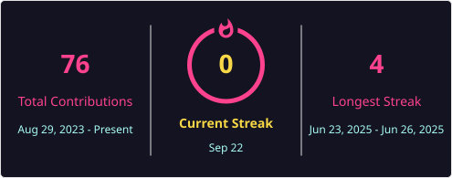

<!--
  Abhinav Tripathi — GitHub Profile README
  Full Stack Developer | MERN Stack | React · Node.js · Python · AWS
  Repository data verified live from the GitHub API on Jul 11, 2026.
  "All Repositories" section auto-refreshes weekly via GitHub Actions.
-->

<h1 align="center">Hi, I'm Abhinav Tripathi 👋</h1>
<h3 align="center">Full Stack Developer | MERN Stack Developer | React · Node.js · Python (Django) · AWS</h3>

  Abhinav Tripathi builds fast, scalable, full-stack web applications — from React/Node.js interfaces to Django and MySQL-backed systems, with growing work in AI-powered tools.

  
  
  
  

  
  
  
  
  

---

## 🚀 About Abhinav Tripathi

I'm **Abhinav Tripathi**, a Frontend and Full Stack Developer specializing in the **MERN stack** (MongoDB, Express.js, React, Node.js), with hands-on experience in **Python/Django**, **MySQL**, **PHP**, and **AWS**. I build responsive, production-ready applications — from AI-powered tools to e-commerce platforms and admin dashboards.

- 🌱 Currently deepening my skills in **AWS**, **Next.js**, and **AI-integrated applications**
- 💬 Ask me about **React, Node.js, Express, MongoDB, MySQL, Python (Django), Angular, or Tailwind CSS**
- 🧠 Recently building AI-powered tools — satellite image analysis, smart to-do apps, and automated report generation
- 📫 Reach me at: **[abhinavtripathi6sep@gmail.com](mailto:abhinavtripathi6sep@gmail.com)**
- 🔗 Connect on **[LinkedIn](https://www.linkedin.com/in/abhinav-tripathi-770224253/)** | View my **[Portfolio](https://portfolio-kappa-six-18.vercel.app/)**
- ⚡ Fun fact: I enjoy playing chess and building side projects late at night

---

## 🛠️ Technologies & Tools

**Frontend**
 

**Backend & Databases**
 

**Cloud, AI/ML & Tools**
 

---

## 🔥 GitHub Stats

> Generated locally via GitHub Actions (see [`.github/workflows/generate-stats.yml`](.github/workflows/generate-stats.yml)) — no dependency on the public `github-readme-stats.vercel.app` instance, which has been unreliable in 2026.

 

 

> 📈 **32+ Total Commits** &nbsp;|&nbsp; 🔁 **20+ Commits in 2025** &nbsp;|&nbsp; 📂 **23 Public Repositories**

---

## 🌟 Featured Projects

| Project | Description | Tech Stack |
|---|---|---|
| 🛰️ [**AI Satellite Image Analysis**](https://github.com/0609Abhinav/AI-Satellite-Image-Analysis-Prototype) | Detects buildings, roads, vegetation & land-use from aerial imagery; compares images across years to flag changes | Python, TypeScript, Computer Vision |
| 🧠 [**Smart-Ex**](https://github.com/0609Abhinav/Smart-Ex) | AI-based proctored examination system with real-time monitoring | MERN, Python, Machine Learning |
| ✅ [**FocusFlow — Smart Todo**](https://github.com/0609Abhinav/FocusFlow_SmartTodo) | AI-powered to-do app with context-aware suggestions & deadline recommendations | Django REST, Next.js, Tailwind CSS |
| 📚 [**Online Book Store**](https://github.com/0609Abhinav/Online-Book-Store) | E-commerce platform with secure payments & authentication | Python, Django |
| 💰 [**Crypto Tracker**](https://github.com/0609Abhinav/Crypto-Tracker) | Real-time cryptocurrency price tracker with live charts | JavaScript, MERN Stack |
| 🎓 [**College Website**](https://github.com/0609Abhinav/College_Website) | Responsive institutional website with student portals | Python, Django, HTML |
| 🗂 [**STFMS**](https://github.com/0609Abhinav/stfms) | Student/Teacher Faculty Management System | PHP, MySQL |
| 🧩 [**Rubik's Cube Visualizer**](https://github.com/0609Abhinav/Rubik-s-Cube) | Interactive 3D Rubik's Cube using `getCubesvg()` | HTML, CSS, JavaScript |
| 🌐 [**Spandan Website**](https://github.com/0609Abhinav/spandan-website) | Event/college fest website | JavaScript |
| 💼 [**Portfolio**](https://github.com/0609Abhinav/Portfolio) | My personal developer portfolio | JavaScript |

---

## 📂 All Repositories

<!-- PROJECTS-START -->
> Auto-generated on 2026-08-30 — 24 public repositories.

| Repository | Description | Language | ⭐ Stars | Updated |
|---|---|---|---|---|
| [Portfolio](https://github.com/0609Abhinav/Portfolio) | About Myself | JavaScript | 2 | Aug 15, 2026 |
| [GOLDEXCHANGER](https://github.com/0609Abhinav/GOLDEXCHANGER) | — | JavaScript | 0 | Aug 13, 2026 |
| [Book-Nest](https://github.com/0609Abhinav/Book-Nest) | A book upload and  downloadable website  | HTML | 1 | Aug 8, 2026 |
| [AI-Satellite-Image-Analysis-Prototype](https://github.com/0609Abhinav/AI-Satellite-Image-Analysis-Prototype) | AI-powered satellite and aerial image analysis prototype that detects buildings, roads, parking lots, vegetation, water, and land-use features using open-source computer vision models. Compares images from different years to identify changes, generates AI-based summaries, and provides a foundation for a future scalable SaaS platform. | Python | 1 | Jul 17, 2026 |
| [Online-Book-Store](https://github.com/0609Abhinav/Online-Book-Store) | This webiste is made from python using Django Framework | CSS | 2 | Jul 10, 2026 |
| [Rubik-s-Cube](https://github.com/0609Abhinav/Rubik-s-Cube) | Simple Rubik's Cube Application using Html,Css and Javascript using getCubesvg() method | JavaScript | 2 | Jul 10, 2026 |
| [Pixelith](https://github.com/0609Abhinav/Pixelith) | — | TypeScript | 2 | Jul 9, 2026 |
| [Crypto-Tracker](https://github.com/0609Abhinav/Crypto-Tracker) | Crypto Currency Tracking Website  | JavaScript | 2 | Jun 19, 2026 |
| [spandan-website](https://github.com/0609Abhinav/spandan-website) | — | JavaScript | 2 | Apr 11, 2026 |
| [dynamic_dashboard_ang](https://github.com/0609Abhinav/dynamic_dashboard_ang) | — | — | 1 | Nov 4, 2025 |
| [Basic-Angular-App](https://github.com/0609Abhinav/Basic-Angular-App) | Basic Angular Application Having Core modules and functionality  | TypeScript | 1 | Oct 29, 2025 |
| [Webapp](https://github.com/0609Abhinav/Webapp) | Web App having all crud operation along with forgot password ,pagiantion ,login, register and db using  my sql sequilizer  | JavaScript | 0 | Oct 24, 2025 |
| [Task-Managment-ToDo-App-](https://github.com/0609Abhinav/Task-Managment-ToDo-App-) | — | JavaScript | 1 | Oct 16, 2025 |
| [student-info-dashboard](https://github.com/0609Abhinav/student-info-dashboard) | — | JavaScript | 0 | Oct 15, 2025 |
| [CRUD-APP](https://github.com/0609Abhinav/CRUD-APP) | Basic CRUD operation using sequilizer in mysql and nodejs+express js | JavaScript | 0 | Oct 6, 2025 |
| [FocusFlow_SmartTodo](https://github.com/0609Abhinav/FocusFlow_SmartTodo) | AI-powered smart to-do list built with Django REST, Next.js, and TailwindCSS — featuring context-aware AI suggestions, priority scoring, and deadline recommendations. | Python | 0 | Aug 15, 2025 |
| [Frontend_Project](https://github.com/0609Abhinav/Frontend_Project) | — | HTML | 0 | Aug 10, 2025 |
| [Photographer-master](https://github.com/0609Abhinav/Photographer-master) | — | JavaScript | 0 | Jul 19, 2025 |
| [Hybrid_CNN_PCA_Full_Package](https://github.com/0609Abhinav/Hybrid_CNN_PCA_Full_Package) | — | Python | 0 | Jul 14, 2025 |
| [webhook-repo](https://github.com/0609Abhinav/webhook-repo) | — | Python | 0 | Jul 14, 2025 |
| [action-repo](https://github.com/0609Abhinav/action-repo) |  Repository to trigger GitHub events | — | 0 | Jul 14, 2025 |
| [Smart-Ex](https://github.com/0609Abhinav/Smart-Ex) | It's AI based proctored examination system developed using MERN Stack and yarious python libraries and AI/ML Technique | Python | 3 | Jun 23, 2025 |
| [stfms](https://github.com/0609Abhinav/stfms) | — | PHP | 1 | Apr 14, 2025 |
| [College_Website](https://github.com/0609Abhinav/College_Website) | This webiste is made from python using Django Framework | HTML | 2 | Aug 20, 2024 |

<!-- PROJECTS-END -->

---

## 💬 Connect with Me

<i>Abhinav Tripathi — Full Stack Developer (MERN Stack), building web & AI-powered applications. Search "Abhinav Tripathi GitHub" to find this profile.</i>

Made with ❤️ by <a href="https://github.com/0609Abhinav">Abhinav Tripathi</a>

